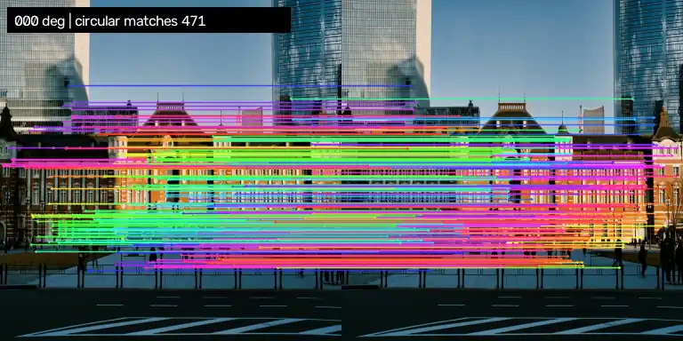
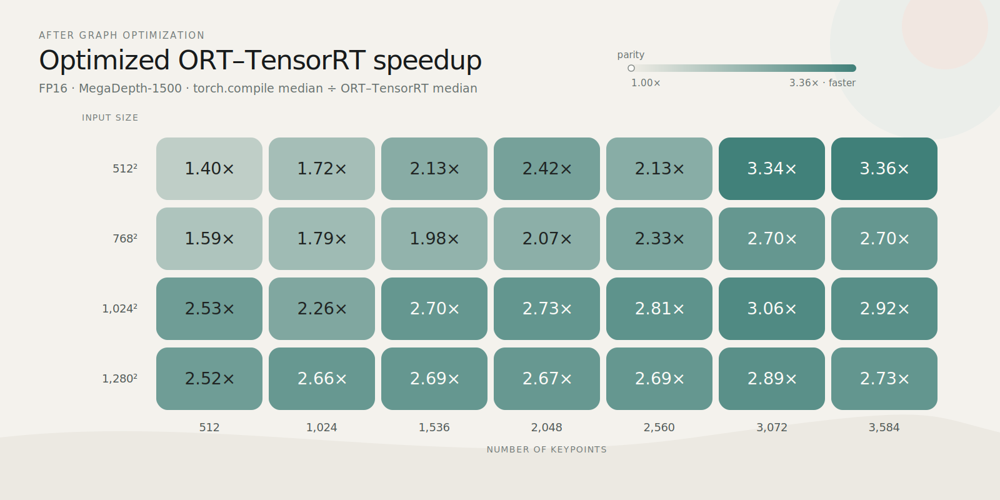
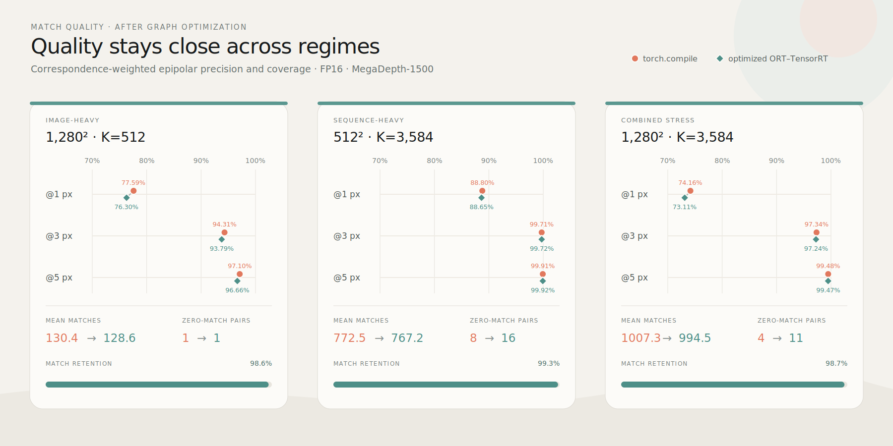
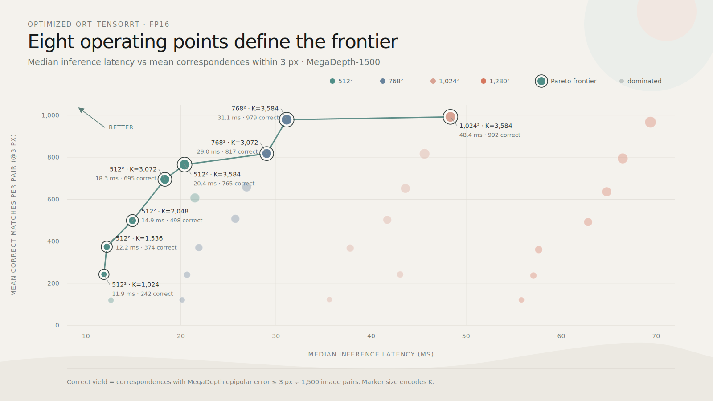

<div align="right"> <a href="https://github.com/fabio-sim/LightGlue-ONNX/blob/main/README.md">English</a> | <a href="https://github.com/fabio-sim/LightGlue-ONNX/blob/main/docs/README.zh.md">简体中文</a> | 日本語</div> 

[](https://onnx.ai/)
[](https://developer.nvidia.com/tensorrt)
[](https://github.com/fabio-sim/LightGlue-ONNX/stargazers)
[](https://github.com/fabio-sim/LightGlue-ONNX/releases)
[](https://fabio-sim.github.io)

# LightGlue ONNX

[LightGlue: Local Feature Matching at Light Speed](https://github.com/cvg/LightGlue) の ONNX（Open Neural Network Exchange）互換実装です。ONNX モデルフォーマットにより、複数の実行プロバイダーに対応し、さまざまなプラットフォーム間での相互運用性が向上します。また、PyTorch などの Python 固有の依存関係を排除します。TensorRT および OpenVINO をサポートしています。[詳細記事](https://fabio-sim.github.io)。

> ✨ ***新機能***: 最適化された RaCo-ALIKED-LightGlue+。詳細はこの [ブログ記事](https://fabio-sim.github.io/blog/gpt-5-6-sol-discovers-tensorrt-optimizations-raco-aliked-lightglue/) をご覧ください。

<p align="center"><a href="https://fabio-sim.github.io/blog/gpt-5-6-sol-discovers-tensorrt-optimizations-raco-aliked-lightglue/"></a></p>

**2026年7月20日**: RaCo-ALIKED-LightGlue+ とベンチマークを追加。

<details>
<summary>更新履歴</summary>

- **2026年1月19日**: FP8 量子化ワークフローのガイドを追加（ModelOpt Q/DQ エクスポートと TensorRT の使用）。[ブログ記事](https://fabio-sim.github.io/blog/fp8-quantized-lightglue-tensorrt-nvidia-model-optimizer/)
- **2026年1月9日**: モダンな uv で CLI UX を刷新し、`lightglue-onnx` のワークフローを整理、非推奨スタックを削除しつつ依存関係と TensorRT/形状推論の案内を更新。
- **2024年7月17日**: エンドツーエンドの並列動的バッチサイズのサポート。スクリプト UX の改良。 [ブログ記事](https://fabio-sim.github.io/blog/accelerating-lightglue-inference-onnx-runtime-tensorrt/) を追加。
- **2023年11月2日**: 約30%のスピードアップのために ArgMax を最適化する TopK トリックを導入。
- **2023年10月4日**: FlashAttention-2 をサポートする `onnxruntime>=1.16.0` を使用した LightGlue ONNX モデルの統合。長いシーケンス長（キーポイントの数）で最大80%の推論速度向上。
- **2023年10月27日**: LightGlue-ONNX が [Kornia](https://kornia.readthedocs.io/en/latest/feature.html#kornia.feature.OnnxLightGlue) に追加されました。
- **2023年7月19日**: TensorRT のサポートを追加。
- **2023年7月13日**: Flash Attention のサポートを追加。
- **2023年7月11日**: Mixed Precision のサポートを追加。
- **2023年7月4日**: 推論時間の比較を追加。
- **2023年7月1日**: `max_num_keypoints` をサポートするエクストラクタを追加。
- **2023年6月30日**: DISK エクストラクタのサポートを追加。
- **2023年6月28日**: エンドツーエンドの SuperPoint+LightGlue エクスポート & 推論パイプラインを追加。
</details>

## ⭐ ONNX エクスポート & 推論

LightGlue を簡単に ONNX へエクスポートし、ONNX Runtime で推論を行うための [typer](https://github.com/tiangolo/typer) CLI `lightglue-onnx` を提供しています。すぐに推論を試したい場合は、[こちら](https://github.com/fabio-sim/LightGlue-ONNX/releases) からすでにエクスポートされた ONNX モデルをダウンロードできます。

## 📦 インストール（uv）

推論のみ（デフォルト）：

```shell
uv sync
```

CPU エクスポート対応（PyTorch、torchvision、ONNX、ONNX Script を追加）：

```shell
uv sync --group export --extra torch-cpu
```

CUDA エクスポートおよび推論対応（Linux x86-64）：

```shell
uv sync --no-group cpu --group cuda --group export --extra torch-cuda
```

TensorRT CLI 対応：

```shell
uv sync --no-group cpu --group cuda --group export --group trt --extra torch-cuda
```

```shell
$ uv run lightglue-onnx --help

Usage: lightglue-onnx [OPTIONS] COMMAND [ARGS]...

LightGlue Dynamo CLI

╭─ コマンド ───────────────────────────────────────╮
│ export   LightGlue を ONNX にエクスポートします。  │
│ infer    LightGlue ONNX モデルの推論を実行します。 │
| trtexec  Polygraphy を使用して純粋な TensorRT     |
|          推論を実行します。                        |
╰──────────────────────────────────────────────────╯
```

各コマンドのオプションを確認するには、`--help` を使用してください。CLI は完全なエクストラクタ-マッチャー パイプラインをエクスポートするため、中間ステップの調整に悩む必要はありません。推論はデフォルトで利用可能な場合に CUDA を使用し、要求したプロバイダーを読み込めない場合は CPU にフォールバックします。

### GPU 前提条件
ONNX Runtime の CUDA/TensorRT 実行プロバイダーには、プラットフォームに対応する CUDA/cuDNN バージョンが必要です。プロバイダーの読み込みエラーが発生した場合は、ONNX Runtime CUDA プロバイダーのドキュメントで CUDA/cuDNN の構成を確認してください。
PyPI 経由で CUDA/TensorRT ランタイムライブラリ（例: `onnxruntime-gpu[cuda,cudnn]`、`tensorrt`）をインストールした場合、Polygraphy と TensorRT EP が `libcudart.so` と `libnvinfer.so` を見つけられるように、venv のパスを `LD_LIBRARY_PATH` に追加する必要があることがあります：

```shell
export LD_LIBRARY_PATH="$PWD/.venv/lib/python3.12/site-packages/tensorrt_libs:$PWD/.venv/lib/python3.12/site-packages/nvidia/cu13/lib:${LD_LIBRARY_PATH:-}"
```

CLI は wheel に含まれるこれらのライブラリを自動的にプリロードしますが、この環境変数は CLI 外から起動するサードパーティ製ツールでも引き続き役立ちます。

## 📖 使用例コマンド

<details>
<summary>🔥 ONNX エクスポート</summary>
<pre>
uv run lightglue-onnx export superpoint \
  --num-keypoints 1024 \
  -b 2 -h 1024 -w 1024 \
  -o weights/superpoint_lightglue_pipeline.onnx
</pre>
</details>

<details>
<summary>⚡ ONNX Runtime 推論 (CUDA)</summary>
<pre>
uv run lightglue-onnx infer \
  weights/superpoint_lightglue_pipeline.onnx \
  assets/sacre_coeur1.jpg assets/sacre_coeur2.jpg \
  superpoint \
  -h 1024 -w 1024 \
  -d cuda
</pre>
</details>

<details>
<summary>🚀 ONNX Runtime 推論 (TensorRT)</summary>
<pre>
uv run lightglue-onnx infer \
  weights/superpoint_lightglue_pipeline.trt.onnx \
  assets/sacre_coeur1.jpg assets/sacre_coeur2.jpg \
  superpoint \
  -h 1024 -w 1024 \
  -d tensorrt --fp16
</pre>
</details>

<details>
<summary>🧩 TensorRT 推論</summary>
<pre>
uv run lightglue-onnx trtexec \
  weights/superpoint_lightglue_pipeline.trt.onnx \
  assets/sacre_coeur1.jpg assets/sacre_coeur2.jpg \
  superpoint \
  -h 1024 -w 1024 \
  --fp16
</pre>
</details>

<details>
<summary>🧪 量子化（TensorRT FP8 Q/DQ）</summary>
<pre>
# 1) 静的形状の ONNX モデルをエクスポート
uv run lightglue-onnx export superpoint \
  --num-keypoints 1024 \
  -b 2 -h 1024 -w 1024 \
  -o weights/superpoint_lightglue_pipeline.static.onnx

# 2) FP8 に量子化（DQ-only グラフ）
uv run lightglue_dynamo/scripts/quantize.py \
  --input weights/superpoint_lightglue_pipeline.static.onnx \
  --output weights/superpoint_lightglue_pipeline.static.fp8.onnx \
  --extractor superpoint \
  --height 1024 --width 1024 \
  --quantize-mode fp8 \
  --dq-only \
  --simplify

# 3) TensorRT で推論（明示的に量子化されたモデル）
uv run lightglue-onnx trtexec \
  weights/superpoint_lightglue_pipeline.static.fp8.onnx \
  assets/sacre_coeur1.jpg assets/sacre_coeur2.jpg \
  superpoint \
  -h 1024 -w 1024 \
  --precision-constraints prefer --fp16
</pre>
</details>

<details>
<summary>🟣 ONNX Runtime 推論 (OpenVINO)</summary>
<pre>
uv run lightglue-onnx infer \
  weights/superpoint_lightglue_pipeline.onnx \
  assets/sacre_coeur1.jpg assets/sacre_coeur2.jpg \
  superpoint \
  -h 512 -w 512 \
  -d openvino
</pre>
</details>

## 🌐 ブラウザー WebGPU デモ

静的デモを配信し、`http://localhost:8000` を開きます：

```shell
uvx static-http --directory web --port 8000 --localhost-only
```

## ⏱️ 推論速度と出力品質

`torch.compile()` とのベンチマーク比較（[詳細はこちら](https://fabio-sim.github.io/blog/gpt-5-6-sol-discovers-tensorrt-optimizations-raco-aliked-lightglue/)）：

<p align="center"><a href="https://fabio-sim.github.io/blog/gpt-5-6-sol-discovers-tensorrt-optimizations-raco-aliked-lightglue/"></a></p>

<p align="center"><a href="https://fabio-sim.github.io/blog/gpt-5-6-sol-discovers-tensorrt-optimizations-raco-aliked-lightglue/"></a></p>

<p align="center"><a href="https://fabio-sim.github.io/blog/gpt-5-6-sol-discovers-tensorrt-optimizations-raco-aliked-lightglue/"></a></p>

## クレジット
もし本リポジトリのコードや論文のアイデアを使用した場合は、[LightGlue](https://arxiv.org/abs/2306.13643)、[SuperPoint](https://arxiv.org/abs/1712.07629)、および [DISK](https://arxiv.org/abs/2006.13566) の著者を引用することを検討してください。また、ONNX バージョンが役に立った場合は、このリポジトリにスターを付けていただけると幸いです。

```txt
@inproceedings{lindenberger23lightglue,
  author    = {Philipp Lindenberger and
               Paul-Edouard Sarlin and
               Marc Pollefeys},
  title     = {{LightGlue}: Local Feature Matching at Light Speed},
  booktitle = {ArXiv PrePrint},
  year      = {2023}
}
```

```txt
@article{DBLP:journals/corr/abs-1712-07629,
  author       = {Daniel DeTone and
                  Tomasz Malisiewicz and
                  Andrew Rabinovich},
  title        = {SuperPoint: Self-Supervised Interest Point Detection and Description},
  journal      = {CoRR},
  volume       = {abs/1712.07629},
  year         = {2017},
  url          = {http://arxiv.org/abs/1712.07629},
  eprinttype    = {arXiv},
  eprint       = {1712.07629},
  timestamp    = {Mon, 13 Aug 2018 16:47:29 +0200},
  biburl       = {https://dblp.org/rec/journals/corr/abs-2006-13566.bib},
  bibsource    = {dblp computer science bibliography, https://dblp.org}
}
```
